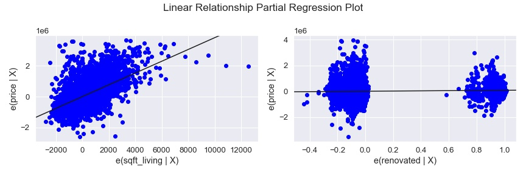
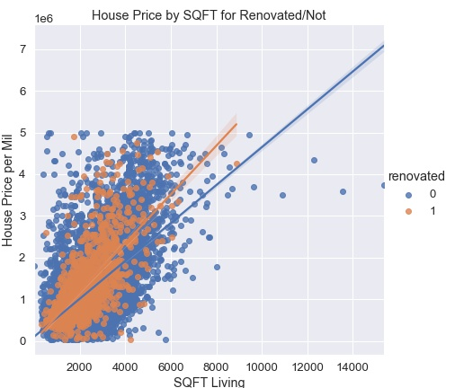
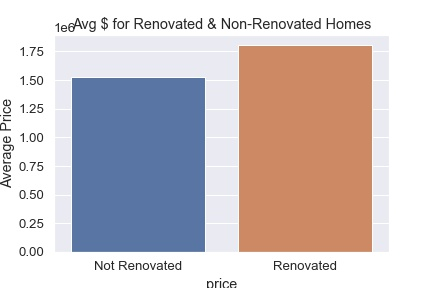

# Real Estate Consulting for King County

#### Authors: Charlie, Gideon, Max

## Overview

[The King County Assessor department](https://info.kingcounty.gov/assessor/DataDownload/default.aspx)is a government agency in King County, Washington, responsible for assessing the value of real estate properties for tax purposes.

The office uses a database collection, which includes data on all the properties in the county, such as property dimensions, ownership information, sale history, and land use. This data is collected from various sources, including property deeds, building permits, surveys, and inspections.

Real estate companies can use the data provided by the King County Assessor's Office to optimize their ROI when flipping houses by identifying properties with the potential to increase in value. By analyzing the sale history, property dimensions, land use, and ownership information, companies can determine which properties are undervalued and have the potential for profit. This can help companies make informed decisions about which properties to invest in, and how much to invest.


## Business Problem

[Real Estate Company, King County Estates](https://kingcountyestates.com/about/the-team/), is looking to expand their portfolio in the King County Real Estate market but they are not sure about the trends in the market. So they've hired our data science team for insights into what property features they should pay attention to to return get the largest return on their investment.

We've developed a multiple linear regression model to give them better insights on the independent and dependent variables that best explain the relationship they have on varying property values.

Our conclusions after the below analysis include identifying:

1. House pricing is most correlated to the squarefeet of living space in a home.
2. On average, a home can expect a  \\$75,000 increase in value after a renovation.
3. Waterfront property is on averate \\$600,000 more than land locked property.
4. Zip codes play a big role on property value


## Data 
    
Our data comes from [The King County Assessor department](https://info.kingcounty.gov/assessor/DataDownload/default.aspx) and represents about 30,000 residential property sales from the years of 2021 and 2022 including information about property features and dimensions as well as sale prices.

## Methods

We will be analyzing the housing data to create a multiple linear regression model using methods such as data cleaning, exploratory data analysis, feature selection, and model training using statistical tools such as Python and more specifically it's statsmodels packages. We'll be using inferential statistics to make conclusions about the relationships between variables and to assess the significance of coefficients. However, it is important to note that inferential statistics are not enough to make predictive conclusions about future housing prices, as the model may not capture all relevant variables, and unforeseeable events can affect the housing market in unpredictable ways.


## Modeling
 
We chose **sqft of living** as our base model for the dependent variable 'price' because it showed the highest correlation with 'price' among all the features in the dataset. The correlation coefficient indicates the strength of a relationship between two variables, and the sqft of living had the highest correlation coefficient with 'price'. Additionally, when we used the sqft of living as the independent variable in a regression model, it had the highest R-squared value, which means that it explained the most variation in the values of 'price'. Lastly, the assumption testing performed on this model was the best among all the features, which means that the model met the assumptions required for regression analysis. Hence, we chose the sqft of living as our base model for the dependent variable 'price' as it was the best predictor of 'price' among all the features in the dataset.


We added zip codes, renovation, and waterfront properties to our base model to create a final model with a higher R-squared value. These features were independent of each other and had high statistically significant coefficients, indicating that they played a vital role in predicting the price of a home. Furthermore, their inclusion in the model resulted in better performance when running assumption tests. Hence, by adding these features, we were able to create a more accurate model that could explain a higher proportion of the variation in home prices.



## Results

The base model and final model are both Ordinary Least Square (OLS) regression models that predict the price of a house based on some explanatory variables. The base model only considers the square footage of the living area of the house, while the final model includes other variables such as the zip code, whether the house was renovated, and if it is a waterfront property.


#### Final Model:
The final model has an R-squared of 0.703, indicating that the explanatory variables in the final model explain 70.3% of the variation in the price of the house.



The final model has 89 explanatory variables, which include zip codes, renovating status, and waterfront property. Each variable has a coefficient, a standard error, a t-value, and a p-value, which are used to determine its significance. In the final model, all the variables are significant (p < 0.05), except for one zip code.


Overall, the final model performs better than the base model because it includes more relevant explanatory variables, providing a better prediction of the price of a house. Regular business people can use the final model to estimate the price of a house based on its features. For example, they can input the square footage of the living area, the zip code, and the renovating status, and the model will predict the price of the house.



## Conclusions
On average, our findings show that properties are valued at \\$382 per square foot. Additionally, renovating the property can increase its value by an average of $72,000, and owning a waterfront property can yield an average of \\$682,000 in extra income. Lastly, we found that zip codes play a crucial role in determining property value. These insights can help guide your investment strategy and maximize your returns.

## Next Steps

####  What Makes A Zipcode Hot?:
- We like to see what it is about zip code that makes it a huge factor. Proximity to freeways, malls, shopping, parks, playgrounds, bus stations?


####  Are There Any Zipcodes that could get Hot?:
- Are there indicators that zipcodes could be trending toward gentrification?

#### Renovation Deep Dive:

- What specific types of renovations are going to provide the most value. In flipping a home?


## For More Information
See the full analysis in the [Jupyter Notebook](./King_County_analysis.ipynb) or review this [presentation](./King_County_Analysis.pdf).

For additional info, contact Charlie at [protigen34](https://github.com/protigen34), Gideon Miles at [Giddybird](https://github.com/Giddybird), or Max Ross at [ImMaxRoss](https://github.com/ImMaxRoss)


## Repository Structure

```
├── data
├── images
├── README.md
├── King_County_Analysis.ipynb
├── King_County_Analysis.pdf
```
